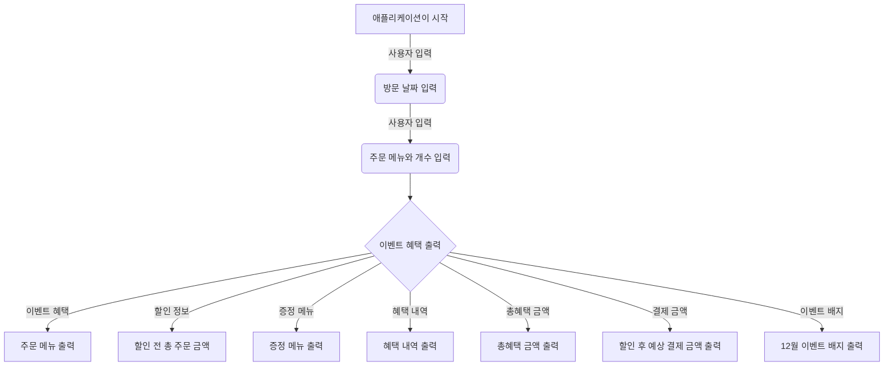

# 📝 기능 구현 목록

### Flow

---
### 🛠️ &nbsp;메인 기능
- ✅ 이벤트 기간은 1일 ~ 31일 동안 적용된다.
  - ✅ ⚠️ &nbsp; 1 이상 31이하의 범위에 해당하지 않으면 예외를 발생시킨다.
  
1️⃣ 사용자 주문
- [ ] 사용자는 주문할 수 있다.
  - [ ] 주문은 [메뉴-개수, 메뉴-개수..] 형식으로 가져오고 쉼표(",")로 메뉴를 구분한다.
    - ✅ ⚠️ &nbsp; 존재하지 않은 메뉴와 중복된 메뉴는 예외를 발생시킨다.
    - ✅ 각 주문 메뉴의 개수는 1개 이상, 20개 이하이다.
        ex)  `[ERROR] 유효하지 않은 주문입니다. 다시 입력해 주세요.`
    - ✅ ⚠️ &nbsp; 각각의 주문 개수와 카운트가 1개 미만, 20개 초과일 경우 예외를 발생시킨다.
  - ✅ 총 주문 개수를 카운트하고 최대 20까지 허용한다.
    - ✅ ⚠️ &nbsp; 각각의 주문 개수와 카운트가 1개 미만, 20개 초과일 경우 예외를 발생시킨다.
  - ✅ 음료만 별도로 주문할 수 없다.
    - ✅ ⚠️ &nbsp; 음료만 주문할 경우 예외를 발생시킨다.

2️⃣ 총 주문 금액
- ✅ 할인 금액을 제외한 총 주문 금액을 계산한다.
- ✅ 할인은 제외한 주문 금액이 12만원 이상이면, 샴페인을 증정한다.

3️⃣ 혜택 내역
- [ ] 혜택 내역을 제공한다.
  - ✅ 할인은 주문금액 1만원부터 적용된다.
  - ✅ 크리스마스 디데이 할인을 계산한다.
    - ✅ 크리스마스 1일 ~ 25일 동안 디데이 할인을 진행한다.
    - ✅ 1,000원부터 시작해서 날마다 100원씩 증가한다.
    - [ ] 총 주문 금액에서 할인 금액만큼 뺀다.
  
- ✅ 평일(일~목)은 디저트 메뉴를 개당 2,023원 할인한다.
- ✅ 주말(금,토)은 메인 메뉴를 개당 2,023원 할인한다.

- ✅ 특별 할인을 계산한다.
  - ✅ 매주 일요일과 25일은 1,000원을 할인한다.

- ✅ 증정을 받았다면 할인으로 포함한다.

- ✅ 총 혜택(할인)금액을 계산한다.

4️⃣ 결제 금액
- ✅ 총 주문 금액과 할인 금액의 차이를 계산한다.

5️⃣ 배지
- [ ] 혜택(할인) 금액에 따라서 배지를 부여한다.
  - [ ] 5천원 이상 별 배지를 부여한다.
  - [ ] 1만원 이상 트리 배지를 부여한다.
  - [ ] 2천원 이상 산타 배지를 부여한다.

 

---  

### 🔨 &nbsp;입력 기능
🌟 사용자가 입력하는 값은 `camp.nextstep.edu.missionutils.Console`의 `readLine()`을 활용한다.  
- [ ] InputView 클래스를 참고하여 입력 클래스를 구현한다.

- [ ] 메세지를 출력하고 식당 예상 방문 날짜를 입력받는다.
  - ex) `12월 중 식당 예상 방문 날짜는 언제인가요? (숫자만 입력해 주세요!)`
  - [ ] ⚠️ &nbsp; 입력이 숫자가 아니면 예외를 발생시킨다.
    - ex) `[ERROR] 유효하지 않은 날짜입니다. 다시 입력해 주세요.`
    
- [ ] 메세지를 출력하고 메뉴와 개수를 입력받는다.
  - ex) `주문하실 메뉴를 메뉴와 개수를 알려 주세요. (e.g. 해산물파스타-2,레드와인-1,초코케이크-1) `
  - [ ] ⚠️ &nbsp; 위 형식과 다르면 예외를 발생시킨다.
  - [ ] ⚠️ &nbsp; 메뉴가 존재하지 않으면 예외를 발생시킨다.
  - [ ] ⚠️ &nbsp; 개수는 1 이상의 숫자가 아니면 예외를 발생시킨다.
  - ex) `[ERROR] 유효하지 않은 주문입니다. 다시 입력해 주세요.`

 

---  
### 🔨 &nbsp;출력 기능
- [ ] OutputView 클래스를 참고하여 출력 클래스를 구현한다.

- [ ] 애플리케이션 시작 메세지를 출력한다.
  - ex) `안녕하세요! 우테코 식당 12월 이벤트 플래너입니다.` 
  
- [ ] 이벤트를 출력을 알리는 메세지를 출력한다.
  - ex) `12월 3일에 우테코 식당에서 받을 이벤트 혜택 미리 보기!`
  
- [ ] 사용자의 주문 메뉴를 출력한다.
  - ex) `<주문 메뉴> 티본스테이크 1개`
  
- [ ] 할인 전 총 주문 금액을 출력한다.
  - ex) `<할인 전 총 주문 금액> 142,000원`
  
- [ ] 증정 메뉴를 출력한다.
  - ex) `<증정 메뉴> 샴페인 1개`
  - 만약 증정 메뉴가 없다면 `없음` 이라고 출력한다.
    - ex) `<증정 메뉴> 없음`
    
- [ ] 혜택 내역을 출력한다.
  - ex) `<혜택 내역> 크리스마스 디데이 할인: -1,200원`
  - 혜택 내역이 하나도 없다면 없음을 출력한다.
    - ex) `<혜택 내역> 없음`
    
- [ ] 총혜택 금액을 출력한다.
  - ex) `<총혜택 금액> -31,246원`

- [ ] 할인 적용 된 금액을 출력한다.
  - ex) `<할인 후 예상 결제 금액> 8,500원`
  
- [ ] 부여받은 배지를 출력한다.
  - ex) `<12월 이벤트 배지> 산타`
  - 만약 받은 배지가 없다면 없음을 출력한다.
    - ex) `<12월 이벤트 배지> 없음`
 

---
### ⚠️ &nbsp;예외 처리

- 사용자의 입력값이 잘못 되었으면
  IllegalArgumentException과 에러 메세지를 출력하고 그 부분부터 다시 입력 받는다.
  - `Exception`이 아닌 `IllegalArgumentException`, `IllegalStateException` 등과 같은 명확한 유형을 처리한다
- 모든 에러 메시지는 `[ERROR]`로 시작한다.
  - ex) `"[ERROR] 유효하지 않은 날짜입니다."`

 

---
### ✚ &nbsp; 프로그래밍 요구 사항
- [ ] `JDK 17 버전에서 실행` 가능해야 한다. JDK 17에서 정상적으로 동작하지 않을 경우 0점 처리한다.
- [ ] 프로그램 실행의 시작점은 `Application의 main()`이다.
- [ ] `build.gradle 파일`을 변경할 수 없고, 외부 라이브러리를 사용하지 않는다.
- [ ] `Java 코드 컨벤션 가이드`를 준수하며 프로그래밍한다.
- [ ] 프로그램 종료 시 `System.exit()`를 호출하지 않는다.
- [ ] 프로그램 구현이 완료되면 `ApplicationTest`의 모든 테스트가 성공해야 한다. 테스트가 실패할 경우 0점 처리한다.
- [ ] 프로그래밍 요구 사항에서 달리 명시하지 않는 한 파일, 패키지 이름을 수정하거나 이동하지 않는다.
- [ ] indent(인덴트, 들여쓰기) `depth를 3이` 넘지 않도록 구현한다. `2까지만 허용`한다.
  - 예를 들어 while문 안에 if문이 있으면 들여쓰기는 2이다.
  - 힌트: indent(인덴트, 들여쓰기) depth를 줄이는 좋은 방법은 함수(또는 메서드)를 분리하면 된다.
- [ ] `3항 연산자`를 쓰지 않는다.
- [ ] 함수(또는 메서드)의 길이가 `15라인`을 넘어가지 않도록 구현한다.
  - 함수(또는 메서드)가 한 가지 일만 하도록 최대한 작게 만들어라.
- [ ] `JUnit 5와 AssertJ`를 이용하여 본인이 정리한 기능 목록이 정상 동작함을 테스트 코드로 확인한다.
- [ ] `else` 예약어를 쓰지 않는다.
  - 힌트: if 조건절에서 값을 return 하는 방식으로 구현하면 else를 사용하지 않아도 된다. 
  - else를 쓰지 말라고 하니 switch/case로 구현하는 경우가 있는데 switch/case도 허용하지 않는다.
- [ ] 도메인 로직에 단위 테스트를 구현해야 한다. 단, UI(System.out, System.in, Scanner) 로직은 제외한다.
  - 핵심 로직을 구현하는 코드와 UI를 담당하는 로직을 분리해 구현한다.
